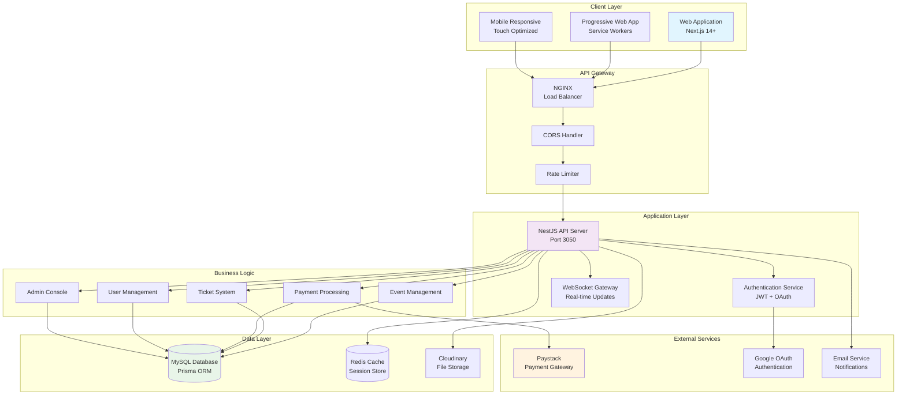
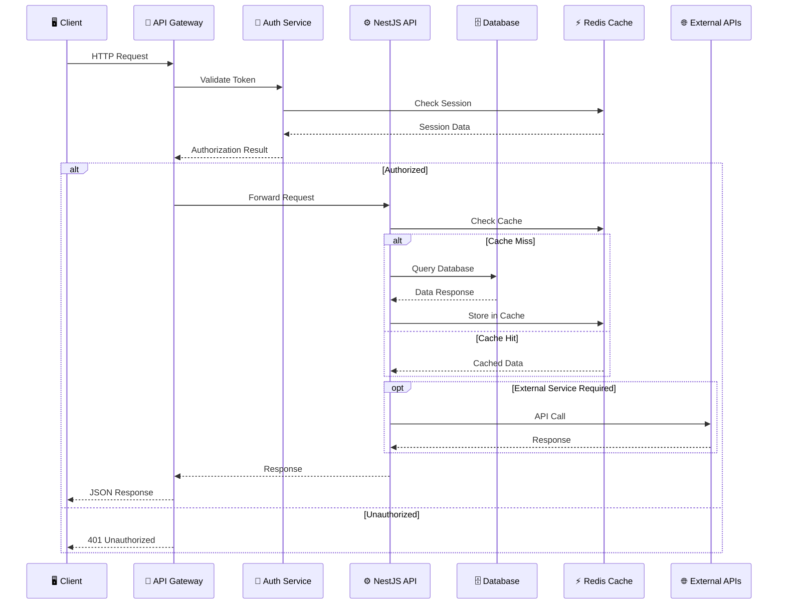
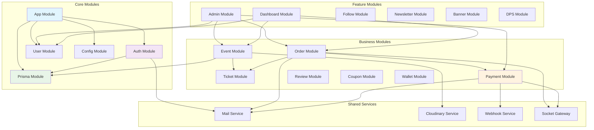
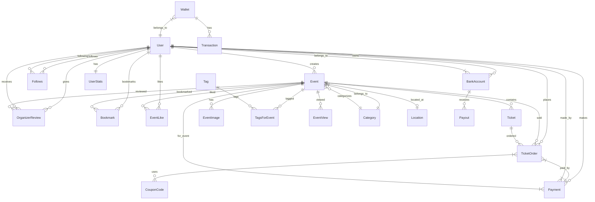
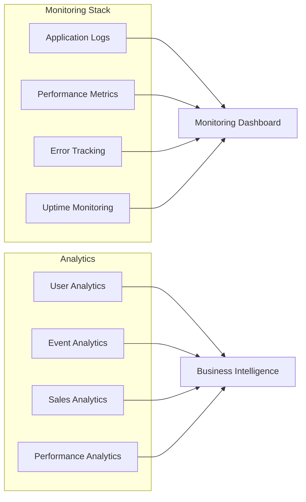
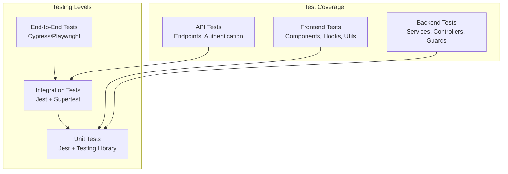

# 🎫 Tickets Deck Application - Comprehensive Architecture Overview

<div align="center">


**A Modern Event Ticketing Platform**

[](https://nextjs.org/)
[](https://nestjs.com/)
[](https://www.typescriptlang.org/)
[](https://www.mysql.com/)
[](https://www.docker.com/)

</div>

---

## 📋 Table of Contents

1. [Project Summary](#-project-summary)
2. [System Architecture](#️-system-architecture)
3. [Technology Stack](#-technology-stack)
4. [Project Structure](#-project-structure)
5. [Database Architecture](#️-database-architecture)
6. [Security & Authentication](#-security--authentication)
7. [Payment System](#-payment-system)
8. [Event Management](#-event-management)
9. [Frontend Architecture](#-frontend-architecture)
10. [Real-time Features](#-real-time-features)
11. [Business Logic Modules](#-business-logic-modules)
12. [Deployment & Infrastructure](#-deployment--infrastructure)
13. [Performance & Scalability](#-performance--scalability)
14. [Development Workflow](#️-development-workflow)
15. [API Documentation](#-api-documentation)

---

## 🎯 Project Summary

**Tickets Deck** is a comprehensive, enterprise-grade event ticketing platform designed to revolutionize how events are created, managed, and experienced. Built with cutting-edge technologies and modern architectural patterns, it provides:

### 🌟 Key Features

- **🎪 Event Management**: Complete lifecycle management from creation to analytics
- **🎫 Ticketing System**: Multi-tier pricing with real-time inventory
- **💳 Payment Processing**: Secure transactions with multiple payment methods
- **👥 Social Features**: User following, reviews, and community engagement
- **📊 Analytics Dashboard**: Comprehensive insights and reporting
- **🔒 Enterprise Security**: Multi-factor authentication and role-based access
- **📱 Progressive Web App**: Mobile-first responsive design
- **⚡ Real-time Updates**: Live notifications and status updates

### 🎯 Target Audience

- **Event Organizers**: Professional event management tools
- **Attendees**: Seamless ticket purchasing experience
- **Administrators**: Platform management and oversight
- **Developers**: Extensible API and webhook system

---

## 🏗️ System Architecture

### High-Level Architecture Diagram



### 🔄 Request Flow Architecture



## 🛠️ Technology Stack

### Frontend Technologies

| Technology           | Version | Purpose                 | Benefits                               |
| -------------------- | ------- | ----------------------- | -------------------------------------- |
| **Next.js**          | 14+     | React Framework         | SSR, App Router, Performance           |
| **TypeScript**       | 5+      | Type Safety             | Developer Experience, Error Prevention |
| **Tailwind CSS**     | 3+      | Utility-First CSS       | Rapid Development, Consistency         |
| **SCSS**             | Latest  | CSS Preprocessor        | Variables, Mixins, Theming             |
| **Redux Toolkit**    | 2+      | State Management        | Predictable State, DevTools            |
| **NextAuth.js**      | 4+      | Authentication          | OAuth, Session Management              |
| **Socket.io Client** | 4+      | Real-time Communication | Live Updates, Notifications            |
| **Axios**            | 1+      | HTTP Client             | Request/Response Interceptors          |
| **React Hook Form**  | 7+      | Form Management         | Performance, Validation                |
| **Chart.js**         | 4+      | Data Visualization      | Analytics, Reporting                   |

### Backend Technologies

| Technology      | Version | Purpose                   | Benefits                      |
| --------------- | ------- | ------------------------- | ----------------------------- |
| **NestJS**      | 10+     | Node.js Framework         | Modular, Scalable, TypeScript |
| **TypeScript**  | 5+      | Type Safety               | Code Quality, IntelliSense    |
| **Prisma**      | 5+      | Database ORM              | Type-safe Queries, Migrations |
| **MySQL**       | 8+      | Primary Database          | ACID Compliance, Performance  |
| **Redis**       | 7+      | Caching & Sessions        | Performance, Scalability      |
| **JWT**         | Latest  | Authentication            | Stateless, Secure             |
| **Passport.js** | 0.7+    | Authentication Middleware | Strategy Pattern, OAuth       |
| **Socket.io**   | 4+      | WebSocket Server          | Real-time Communication       |
| **Cloudinary**  | Latest  | File Storage              | Image Optimization, CDN       |
| **Paystack**    | Latest  | Payment Processing        | Secure Transactions           |

### DevOps & Infrastructure

| Technology         | Purpose              | Benefits                      |
| ------------------ | -------------------- | ----------------------------- |
| **Docker**         | Containerization     | Consistency, Portability      |
| **Docker Compose** | Multi-container Apps | Development Environment       |
| **NGINX**          | Reverse Proxy        | Load Balancing, SSL           |
| **PM2**            | Process Management   | Auto-restart, Clustering      |
| **GitHub Actions** | CI/CD Pipeline       | Automated Testing, Deployment |
| **ESLint**         | Code Linting         | Code Quality, Standards       |
| **Prettier**       | Code Formatting      | Consistency, Readability      |
| **Jest**           | Testing Framework    | Unit & Integration Tests      |

## 📁 Project Structure

### 🎨 Frontend Architecture (Next.js 14+)

```
📦 app/
├── 📁 (user-console)/              # Protected user dashboard routes
│   ├── 📁 app/                     # Main application pages
│   │   ├── 📁 events/              # Event management
│   │   ├── 📁 tickets/             # Ticket management
│   │   ├── 📁 orders/              # Order history
│   │   ├── 📁 analytics/           # User analytics
│   │   └── 📁 settings/            # User preferences
│   └── 📄 layout.tsx               # User console layout
├── 📁 components/                  # Reusable UI components
│   ├── 📁 ui/                      # Base UI components
│   ├── 📁 forms/                   # Form components
│   ├── 📁 modals/                  # Modal dialogs
│   ├── 📁 charts/                  # Data visualization
│   └── 📁 shared/                  # Shared components
├── 📁 api/                         # API client & routes
│   ├── 📄 apiClient.ts             # Axios configuration
│   ├── 📄 apiRoutes.ts             # API endpoints
│   └── 📁 hooks/                   # Custom API hooks
├── 📁 styles/                      # Styling system
│   ├── 📄 globals.scss             # Global styles & themes
│   ├── 📄 variables.scss           # SCSS variables
│   └── 📄 components.scss          # Component styles
├── 📁 redux/                       # State management
│   ├── 📄 store.ts                 # Redux store configuration
│   ├── 📁 slices/                  # Feature slices
│   └── 📁 middleware/              # Custom middleware
├── 📁 types/                       # TypeScript definitions
├── 📁 utils/                       # Utility functions
├── 📁 hooks/                       # Custom React hooks
├── 📁 context/                     # React contexts
├── 📄 layout.tsx                   # Root layout
├── 📄 page.tsx                     # Homepage
├── 📄 loading.tsx                  # Loading UI
├── 📄 error.tsx                    # Error UI
└── 📄 not-found.tsx                # 404 page
```

### ⚙️ Backend Architecture (NestJS)

```
📦 src/
├── 📁 modules/                     # Feature modules
│   ├── 📁 auth/                    # Authentication & authorization
│   │   ├── 📄 auth.controller.ts   # Auth endpoints
│   │   ├── 📄 auth.service.ts      # Auth business logic
│   │   ├── 📄 auth.module.ts       # Module definition
│   │   ├── 📁 dto/                 # Data transfer objects
│   │   ├── 📁 guards/              # Auth guards
│   │   └── 📁 strategies/          # Passport strategies
│   ├── 📁 user/                    # User management
│   ├── 📁 event/                   # Event management
│   ├── 📁 ticket/                  # Ticket system
│   ├── 📁 payment/                 # Payment processing
│   ├── 📁 order/                   # Order management
│   ├── 📁 admin/                   # Admin functionality
│   ├── 📁 review/                  # Review system
│   ├── 📁 coupon/                  # Coupon management
│   ├── 📁 wallet/                  # Wallet system
│   ├── 📁 newsletter/              # Newsletter management
│   ├── 📁 dashboard/               # Dashboard analytics
│   ├── 📁 follow/                  # Social following
│   ├── 📁 transaction/             # Transaction tracking
│   ├── 📁 banners/                 # Banner management
│   └── 📁 dps/                     # Display picture management
├── 📁 shared/                      # Shared services
│   ├── 📁 mail/                    # Email service
│   ├── 📁 cloudinary/              # File upload service
│   ├── 📁 webhooks/                # Webhook handlers
│   └── 📁 utils/                   # Utility functions
├── 📁 gateway/                     # WebSocket gateway
│   └── 📄 socket.gateway.ts        # Real-time communication
├── 📁 prisma/                      # Database service
│   ├── 📄 prisma.service.ts        # Prisma client
│   └── 📄 prisma.module.ts         # Prisma module
├── 📁 config/                      # Configuration
│   └── 📁 app/                     # App configuration
├── 📁 guards/                      # Global guards
├── 📁 interceptors/                # Global interceptors
├── 📁 filters/                     # Exception filters
├── 📁 decorators/                  # Custom decorators
├── 📁 enums/                       # Enumerations
├── 📁 constants/                   # Application constants
├── 📁 helpers/                     # Helper functions
├── 📁 utils/                       # Utility functions
├── 📄 app.module.ts                # Root module
├── 📄 app.controller.ts            # Root controller
├── 📄 app.service.ts               # Root service
└── 📄 main.ts                      # Application entry point
```

### 🗄️ Database Schema Structure

```
📦 prisma/
├── 📁 schema/                      # Modular schema files
│   ├── 📄 schema.prisma            # Main schema configuration
│   ├── 📄 user.prisma              # User-related models
│   ├── 📄 event.prisma             # Event-related models
│   ├── 📄 ticket.prisma            # Ticket-related models
│   ├── 📄 payment.prisma           # Payment-related models
│   ├── 📄 order.prisma             # Order-related models
│   ├── 📄 review.prisma            # Review-related models
│   ├── 📄 coupon.prisma            # Coupon-related models
│   ├── 📄 wallet.prisma            # Wallet-related models
│   ├── 📄 social.prisma            # Social features models
│   └── 📄 admin.prisma             # Admin-related models
├── 📁 migrations/                  # Database migrations
└── 📄 seed.ts                      # Database seeding
```

### 📊 Module Dependency Diagram



## 🗄️ Database Architecture

### 📊 Entity Relationship Diagram



### 🏗️ Core Database Models

#### 👤 User Management Models

| Model         | Purpose               | Key Fields                                                         |
| ------------- | --------------------- | ------------------------------------------------------------------ |
| **User**      | Core user entity      | `id`, `email`, `username`, `firstName`, `lastName`, `profilePhoto` |
| **UserStats** | User statistics       | `eventsCount`, `followersCount`, `followingCount`, `totalEarnings` |
| **UserToken** | Authentication tokens | `accessToken`, `refreshToken`, `emailVerificationToken`            |
| **UserFlag**  | User moderation       | `flagType`, `reason`, `isActive`                                   |

#### 🎪 Event Management Models

| Model          | Purpose              | Key Fields                                                         |
| -------------- | -------------------- | ------------------------------------------------------------------ |
| **Event**      | Core event entity    | `eventId`, `title`, `description`, `startDate`, `endDate`, `venue` |
| **EventImage** | Event media          | `imageUrl`, `imageId`, `isPrimary`                                 |
| **Category**   | Event categorization | `name`, `description`, `isActive`                                  |
| **Tag**        | Event tagging        | `name`                                                             |
| **Location**   | Event locations      | `name`, `address`, `city`, `state`, `country`                      |

#### 🎫 Ticketing & Payment Models

| Model           | Purpose             | Key Fields                                                     |
| --------------- | ------------------- | -------------------------------------------------------------- |
| **Ticket**      | Ticket types        | `name`, `price`, `quantity`, `remainingTickets`, `description` |
| **TicketOrder** | Purchase records    | `orderReference`, `quantity`, `totalAmount`, `status`          |
| **Payment**     | Transaction records | `transactionReference`, `amount`, `currency`, `status`         |
| **Wallet**      | User balance        | `balance`, `currency`, `isActive`                              |
| **CouponCode**  | Discount system     | `code`, `discountType`, `discountValue`, `maxUses`             |

#### 👥 Social Features Models

| Model               | Purpose                 | Key Fields                                |
| ------------------- | ----------------------- | ----------------------------------------- |
| **Follows**         | User relationships      | `followerId`, `followingId`, `followedAt` |
| **OrganizerReview** | Event organizer ratings | `rating`, `comment`, `isVerified`         |
| **Bookmark**        | Saved events            | `userId`, `eventId`, `bookmarkedAt`       |
| **EventLike**       | Event favorites         | `userId`, `eventId`, `likedAt`            |

### 🔗 Key Database Relationships

#### Primary Business Logic

- **User ↔ Event**: One-to-Many (User creates multiple Events)
- **Event ↔ Ticket**: One-to-Many (Event has multiple Ticket types)
- **User ↔ TicketOrder**: One-to-Many (User places multiple Orders)
- **TicketOrder ↔ Payment**: One-to-One (Each Order has one Payment)
- **Event ↔ Category**: Many-to-One (Events belong to Categories)

#### Social & Engagement

- **User ↔ Follows**: Many-to-Many (Users follow each other)
- **User ↔ OrganizerReview**: Many-to-Many (Users review Organizers)
- **User ↔ Bookmark**: Many-to-Many (Users bookmark Events)
- **User ↔ EventLike**: Many-to-Many (Users like Events)

#### Financial Operations

- **User ↔ Wallet**: One-to-One (Each User has one Wallet)
- **Wallet ↔ Transaction**: One-to-Many (Wallet has multiple Transactions)
- **User ↔ BankAccount**: One-to-Many (User has multiple Bank Accounts)

### 🔍 Database Indexing Strategy

#### Primary Indexes

```sql
-- User lookups
CREATE INDEX idx_users_email ON users(email);
CREATE INDEX idx_users_username ON users(username);

-- Event queries
CREATE INDEX idx_events_publisher ON events(publisherId);
CREATE INDEX idx_events_category ON events(categoryId);
CREATE INDEX idx_events_date ON events(startDate, endDate);

-- Order processing
CREATE INDEX idx_orders_user ON ticket_orders(userId);
CREATE INDEX idx_orders_event ON ticket_orders(eventId);
CREATE INDEX idx_orders_status ON ticket_orders(status);

-- Payment tracking
CREATE INDEX idx_payments_reference ON payments(transactionReference);
CREATE INDEX idx_payments_user ON payments(userId);
```

## 🔐 Security & Authentication

### Authentication Methods

- **Credential-based**: Email/password with JWT
- **OAuth**: Google authentication
- **Session Management**: Secure token handling
- **Role-based Access**: User/Admin permissions

### Security Features

- JWT token validation
- API key authentication
- CORS configuration
- Input validation and sanitization
- Rate limiting capabilities

## 💳 Payment System

### Paystack Integration

- Payment initialization and processing
- Transaction verification
- Webhook handling for real-time updates
- Fee management (organizer vs. customer pays)
- Refund processing

### Financial Features

- Multi-currency support (default: NGN)
- Transaction fee calculation
- Wallet system for users
- Payout management for organizers
- Coupon and discount system

## 🎪 Event Management

### Event Features

- **Creation**: Rich event details with image upload
- **Ticketing**: Multiple ticket types with pricing
- **Visibility**: Public/private event controls
- **Categories**: Event categorization system
- **Tags**: Flexible tagging system
- **Analytics**: View tracking and statistics

### Ticket System

- **Pricing Tiers**: Multiple ticket types per event
- **Inventory**: Real-time availability tracking
- **Purchase Limits**: Per-user ticket limits
- **Time Controls**: Purchase start/end dates

## 🎨 Frontend Architecture

### Styling System

- **SCSS**: Custom styling with variables
- **Tailwind CSS**: Utility-first CSS framework
- **Theme System**: Light/dark mode support
- **Responsive Design**: Mobile-first approach
- **Component Library**: Reusable UI components

### State Management

- **Redux Toolkit**: Centralized state management
- **API Integration**: Axios-based API client
- **Session Management**: NextAuth.js integration
- **Real-time Updates**: Socket.io client

## 🔌 Real-time Features

### WebSocket Implementation

- **User Verification**: Real-time email verification
- **Payment Updates**: Live payment status
- **Event Updates**: Real-time event changes
- **Notifications**: Instant user notifications

## 📊 Business Logic Modules

### Core Modules

1. **Authentication**: User registration, login, OAuth
2. **User Management**: Profiles, preferences, statistics
3. **Event System**: Creation, editing, management
4. **Ticketing**: Sales, inventory, pricing
5. **Payment Processing**: Transactions, verification
6. **Order Management**: Purchase tracking, fulfillment
7. **Social Features**: Following, reviews, bookmarks
8. **Admin Console**: Platform management
9. **Analytics**: Reporting and insights
10. **Communication**: Email notifications, webhooks

### Supporting Features

- **Newsletter**: Subscription management
- **Banners**: Promotional content
- **Coupons**: Discount system
- **Reviews**: Organizer rating system
- **Wallet**: User balance management

## 🚀 Deployment & Infrastructure

### Containerization

- **Docker**: Multi-stage build process
- **Environment Configuration**: Dev/test/prod environments
- **Database Migrations**: Prisma-managed schema
- **Health Checks**: Application monitoring

### API Configuration

- **Base URLs**: Environment-specific endpoints
- **CORS**: Cross-origin resource sharing
- **Rate Limiting**: API protection
- **Logging**: Comprehensive error tracking

## 📈 Scalability Features

### Performance Optimizations

- **Database Indexing**: Optimized queries
- **Image Optimization**: Cloudinary integration
- **Caching**: Strategic data caching
- **Lazy Loading**: Component-level optimization

### Monitoring & Analytics

- **Event Tracking**: User interaction analytics
- **Performance Metrics**: Application monitoring
- **Error Tracking**: Comprehensive logging
- **Business Intelligence**: Sales and usage analytics

## 🔧 Development Workflow

### Code Quality

- **TypeScript**: Type safety across the stack
- **Validation**: Input validation with class-validator
- **Error Handling**: Centralized error management
- **Testing**: Unit and integration testing setup

### API Design

- **RESTful**: Standard HTTP methods and status codes
- **Validation**: Request/response validation
- **Documentation**: Swagger/OpenAPI integration
- **Versioning**: API version management

---

## 📈 Performance & Scalability

### 🚀 Performance Optimizations

#### Frontend Optimizations

- **Code Splitting**: Dynamic imports for route-based splitting
- **Image Optimization**: Next.js Image component with Cloudinary
- **Bundle Analysis**: Webpack bundle analyzer integration
- **Lazy Loading**: Component and route-level lazy loading
- **Caching Strategy**: Browser caching with service workers

#### Backend Optimizations

- **Database Connection Pooling**: Prisma connection management
- **Query Optimization**: Efficient database queries with indexes
- **Response Caching**: Redis-based API response caching
- **Compression**: Gzip compression for API responses
- **CDN Integration**: Cloudinary for static asset delivery

### 📊 Monitoring & Analytics

#### Application Monitoring



#### Key Performance Indicators (KPIs)

| Metric                  | Target  | Monitoring                    |
| ----------------------- | ------- | ----------------------------- |
| **API Response Time**   | < 200ms | Real-time monitoring          |
| **Database Query Time** | < 50ms  | Query performance logs        |
| **Page Load Time**      | < 2s    | Frontend performance tracking |
| **Uptime**              | 99.9%   | Health check monitoring       |
| **Error Rate**          | < 0.1%  | Error tracking and alerting   |

## 🔧 Development Workflow

### 🛠️ Development Environment Setup

#### Prerequisites

```bash
# Required software versions
Node.js >= 18.0.0
npm >= 9.0.0
Docker >= 20.0.0
MySQL >= 8.0.0
Redis >= 7.0.0
```

#### Local Development Setup

```bash
# Clone repository
git clone https://github.com/your-org/tickets-deck-application.git
cd tickets-deck-application

# Install dependencies
npm install

# Setup environment variables
cp .env.example .env.local
# Configure database and API keys

# Setup database
npx prisma generate
npx prisma db push
npx prisma db seed

# Start development servers
npm run dev:frontend  # Next.js on port 9000
npm run dev:backend   # NestJS on port 3050
```

### 🧪 Testing Strategy

#### Testing Pyramid



#### Test Configuration

```typescript
// Jest configuration for backend
export default {
  moduleFileExtensions: ["js", "json", "ts"],
  rootDir: "src",
  testRegex: ".*\\.spec\\.ts$",
  transform: {
    "^.+\\.(t|j)s$": "ts-jest",
  },
  collectCoverageFrom: ["**/*.(t|j)s", "!**/*.spec.ts", "!**/node_modules/**"],
  coverageDirectory: "../coverage",
  testEnvironment: "node",
};
```

### 🚀 CI/CD Pipeline

#### GitHub Actions Workflow

```yaml
name: CI/CD Pipeline

on:
  push:
    branches: [main, develop]
  pull_request:
    branches: [main]

jobs:
  test:
    runs-on: ubuntu-latest
    steps:
      - uses: actions/checkout@v3
      - uses: actions/setup-node@v3
        with:
          node-version: "18"
      - run: npm ci
      - run: npm run test
      - run: npm run test:e2e

  build:
    needs: test
    runs-on: ubuntu-latest
    steps:
      - uses: actions/checkout@v3
      - run: docker build -t tickets-deck .
      - run: docker push ${{ secrets.DOCKER_REGISTRY }}/tickets-deck

  deploy:
    needs: build
    runs-on: ubuntu-latest
    if: github.ref == 'refs/heads/main'
    steps:
      - run: kubectl apply -f k8s/
```

## 📚 API Documentation

### 🔗 RESTful API Endpoints

#### Authentication Endpoints

| Method | Endpoint                    | Description            | Auth Required |
| ------ | --------------------------- | ---------------------- | ------------- |
| `POST` | `/auth/register`            | User registration      | ❌            |
| `POST` | `/auth/login`               | User login             | ❌            |
| `POST` | `/auth/refresh`             | Refresh token          | ✅            |
| `POST` | `/auth/logout`              | User logout            | ✅            |
| `POST` | `/auth/forgot-password`     | Password reset request | ❌            |
| `POST` | `/auth/reset-password`      | Password reset         | ❌            |
| `GET`  | `/auth/verify-email/:token` | Email verification     | ❌            |

#### Event Management Endpoints

| Method   | Endpoint               | Description       | Auth Required |
| -------- | ---------------------- | ----------------- | ------------- |
| `GET`    | `/events`              | List all events   | ❌            |
| `GET`    | `/events/:id`          | Get event details | ❌            |
| `POST`   | `/events`              | Create new event  | ✅            |
| `PUT`    | `/events/:id`          | Update event      | ✅            |
| `DELETE` | `/events/:id`          | Delete event      | ✅            |
| `GET`    | `/events/:id/tickets`  | Get event tickets | ❌            |
| `GET`    | `/events/user/:userId` | Get user events   | ✅            |

#### Order & Payment Endpoints

| Method | Endpoint                | Description         | Auth Required |
| ------ | ----------------------- | ------------------- | ------------- |
| `POST` | `/orders`               | Create ticket order | ✅            |
| `GET`  | `/orders/:id`           | Get order details   | ✅            |
| `GET`  | `/orders/user/:userId`  | Get user orders     | ✅            |
| `POST` | `/payments/process`     | Process payment     | ✅            |
| `GET`  | `/payments/verify/:ref` | Verify payment      | ✅            |

### 📝 API Response Format

#### Standard Response Structure

```typescript
interface ApiResponse<T> {
  success: boolean;
  message: string;
  data?: T;
  error?: {
    code: string;
    details: string;
  };
  meta?: {
    pagination?: {
      page: number;
      limit: number;
      total: number;
      totalPages: number;
    };
  };
}
```

#### Error Response Examples

```json
{
  "success": false,
  "message": "Validation failed",
  "error": {
    "code": "VALIDATION_ERROR",
    "details": "Email is required"
  }
}
```

---

## 🎯 Conclusion

**Tickets Deck** represents a modern, scalable, and comprehensive event ticketing platform built with industry best practices and cutting-edge technologies. The architecture supports:

### ✅ Key Strengths

- **Scalable Architecture**: Microservices-ready modular design
- **Modern Tech Stack**: Latest versions of proven technologies
- **Security First**: Comprehensive security measures and compliance
- **Developer Experience**: Type-safe development with excellent tooling
- **Performance Optimized**: Efficient database queries and caching strategies
- **Real-time Capabilities**: Live updates and notifications
- **Extensible Design**: Easy to add new features and integrations

### 🚀 Future Roadmap

- **Microservices Migration**: Gradual transition to microservices architecture
- **Mobile Applications**: Native iOS and Android apps
- **Advanced Analytics**: Machine learning-powered insights
- **Multi-tenant Support**: White-label solutions for enterprises
- **Blockchain Integration**: NFT tickets and cryptocurrency payments
- **Global Expansion**: Multi-language and multi-currency support

### 📞 Support & Maintenance

- **Documentation**: Comprehensive API and developer documentation
- **Monitoring**: 24/7 system monitoring and alerting
- **Updates**: Regular security updates and feature releases
- **Support**: Dedicated technical support team

---

_This architecture documentation serves as a comprehensive guide for developers, stakeholders, and system administrators working with the Tickets Deck platform. The modular design ensures maintainability, scalability, and extensibility for future growth._
